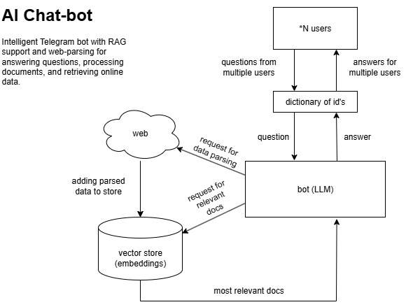
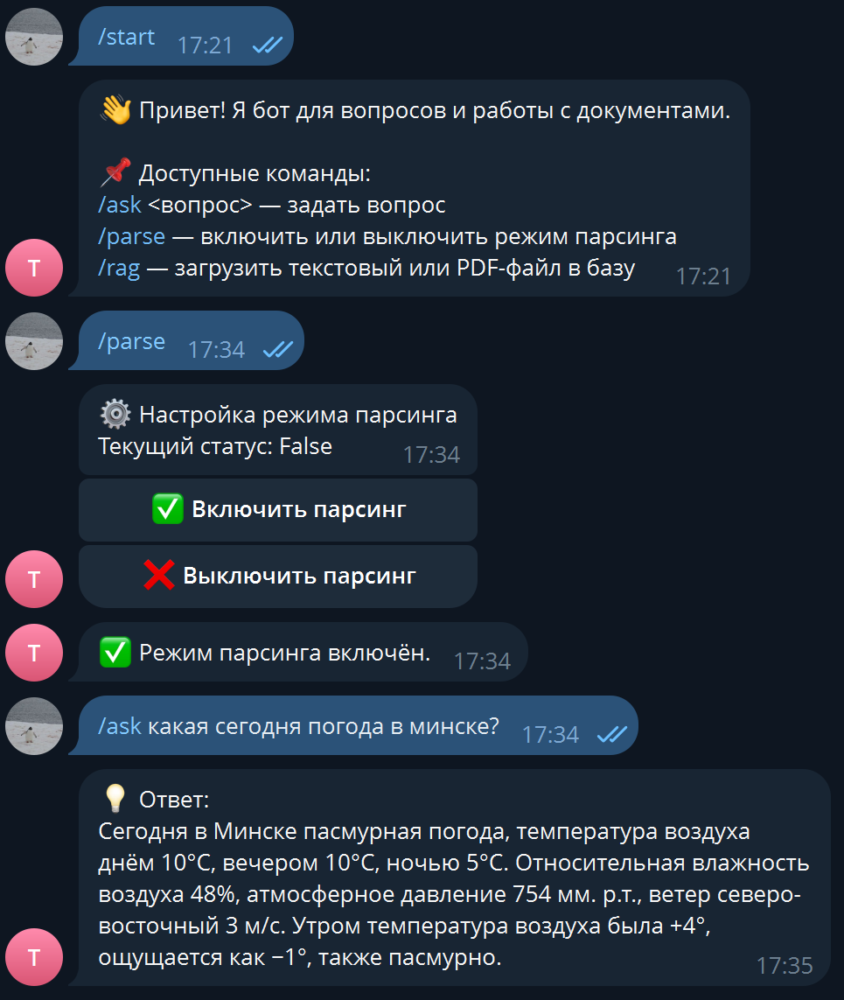

# LLM-powered Telegram Bot with RAG and Web Parsing


> Test assignment solution for **AI-bot developer internship at Sberbank**  
> Telegram bot with Russian dialogue, RAG over user documents, and live web parsing.

Solution to the test case for "AI-bot developer" intership at [Sberbank](https://www.sberbank.ru/). Goal: build a Telegram bot powered by a large language model with Russian dialogue, Retrieval‑Augmented Generation (RAG) over user documents, and a web‑parsing module to incorporate fresh information into answers.
The core application logic (LLM, templates, RAG pipeline) is built on LangChain.

## Architecture

- **LLM**: LLaMA 3.3 Versatile (70B), accessed via Groq API  
- **Dialogue language**: Russian  
- **Framework**: LangChain  
- **Vector store**: Qdrant  
- **Embeddings**: ru-en-RoSBERTa (Hugging Face)  
- **Interface**: Telegram Bot API  

The system supports Retrieval-Augmented Generation (RAG) over user-uploaded documents
and optional web parsing for incorporating fresh information into responses.

## System overview



## Supported commands

| command | description |
|--------|-------|
| /start | bot description and command list |
| /ask <que> | ask the bot |
| /parse | enable/disable parsing from the web |
| /rag | upload documents to the knowledge base (.txt, .md, .pdf) |

# Getting Started

1. Register a new telegram bot using [@BotFather] and obtain the token
2. Create a `.env` file and paste your tokens in the sections below:
```
GROQ_API_KEY=
BOT_TOKEN=
```
3. Install dependencies
```bash
cd cd telegram-llm-bot
pip install -r requirements.txt
```
4. And run the `bot.py` module:
```bash
python bot.py
```

## Usage example



## Roadmap

- Add multiprocessing
- Optimize data extraction from vectorstore (relevance score, reranker)
- Organize documents by users
- Implement automatic storage
- UI/UX upgrade (mini-app)
- Local LLM

## Troubleshooting

- When multiple users are using requests, the bot crashes
- Many users has shared storage. This can easily cause dataleaks
